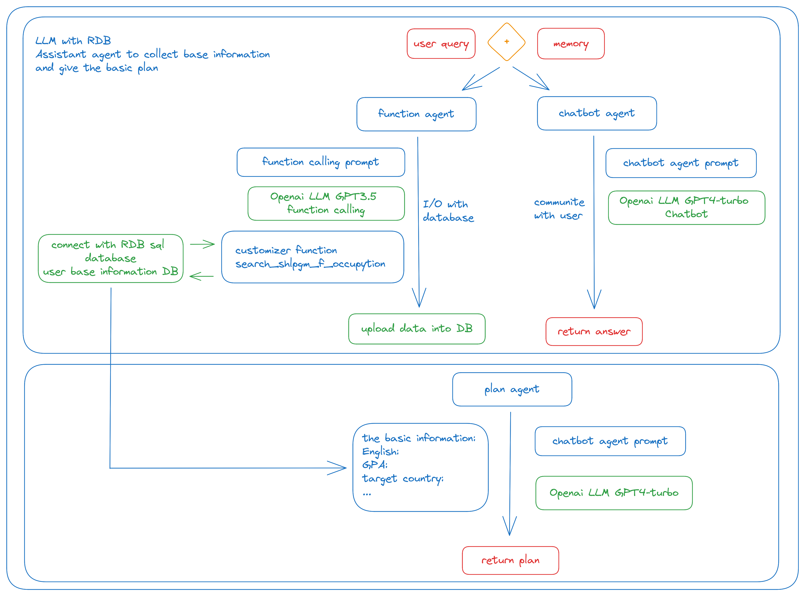

# CONSULTAGENT demo

## Code Structure

agent1.py

    Purpose: Constructs function calling for Language Learning Models (LLMs).
    Key Features: Interfaces with LLMs to perform function calling task based on user input.

agent2.py

    Purpose: Constructs the chatbot using LLMs.
    Key Features: Powers the core chatbot functionality, giving the response base on user input.

config.py and config.yaml

    Purpose: Used for storing and retrieving essential configuration details required by the models.
    Key Features: Includes settings for model parameters, environmental variables, and other control information.

connect_db.py

    Purpose: Manages interactions with the MySQL database.
    Key Features: Contains functions for database operations, ensuring smooth data handling and retrieval.

database.py

    Purpose: Establishes the data structure for the MySQL database.
    Key Features: Defines tables, relationships, and schema for efficient data storage and access.

function.py

    Purpose: Constructs JSON formats to facilitate custom function rules understandable by OpenAI.
    Key Features: Provides a bridge between user-defined functions and OpenAI's understanding.

prompt.py

    Purpose: Stores prompt words.

service_chat.py (without Streamlit)

    Purpose: Builds the chatagent function without using Streamlit.

service_chat_st.py (with Streamlit) (This file may be ignored for basic setup)

    Purpose: Builds the chatagent function using Streamlit. 

service_plan.py

    Purpose: Functions as the planning agent.