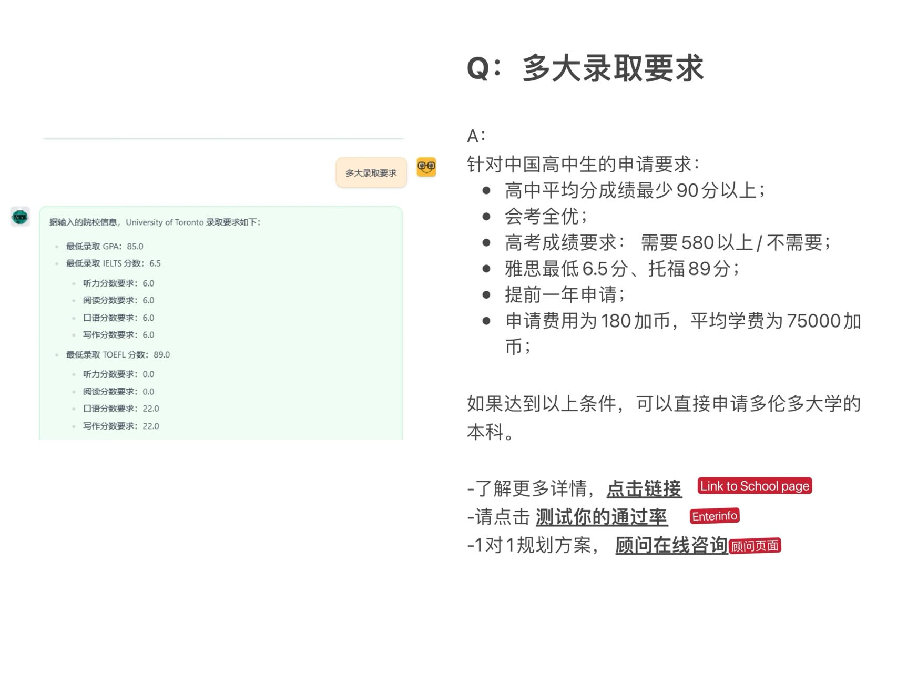
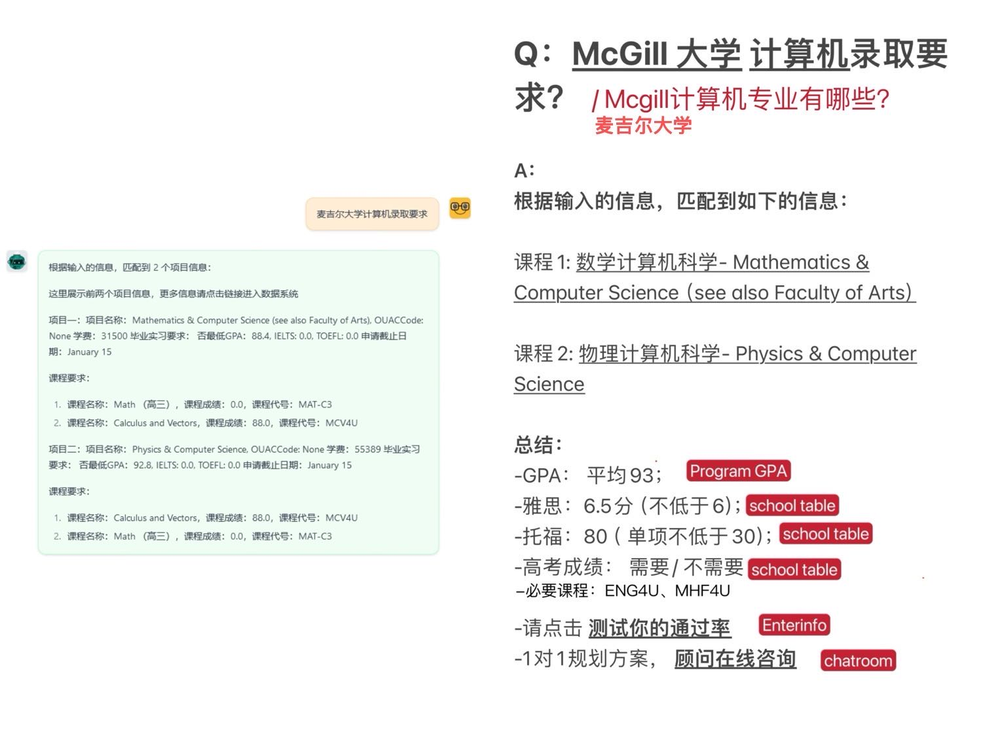
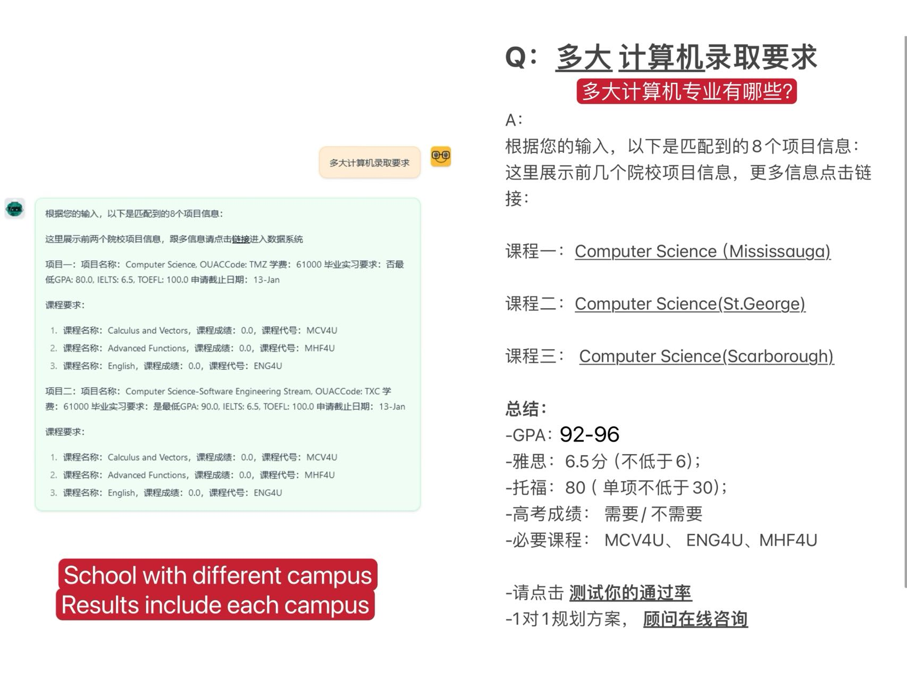
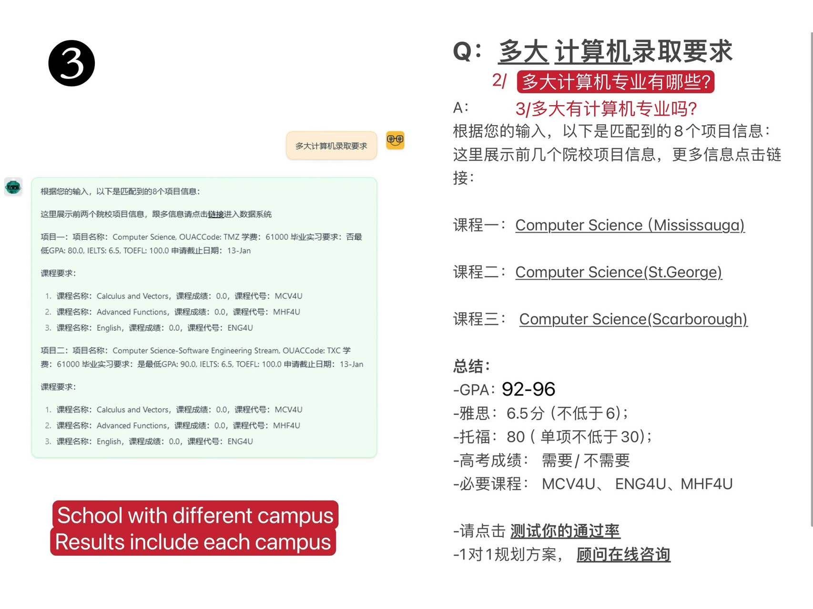
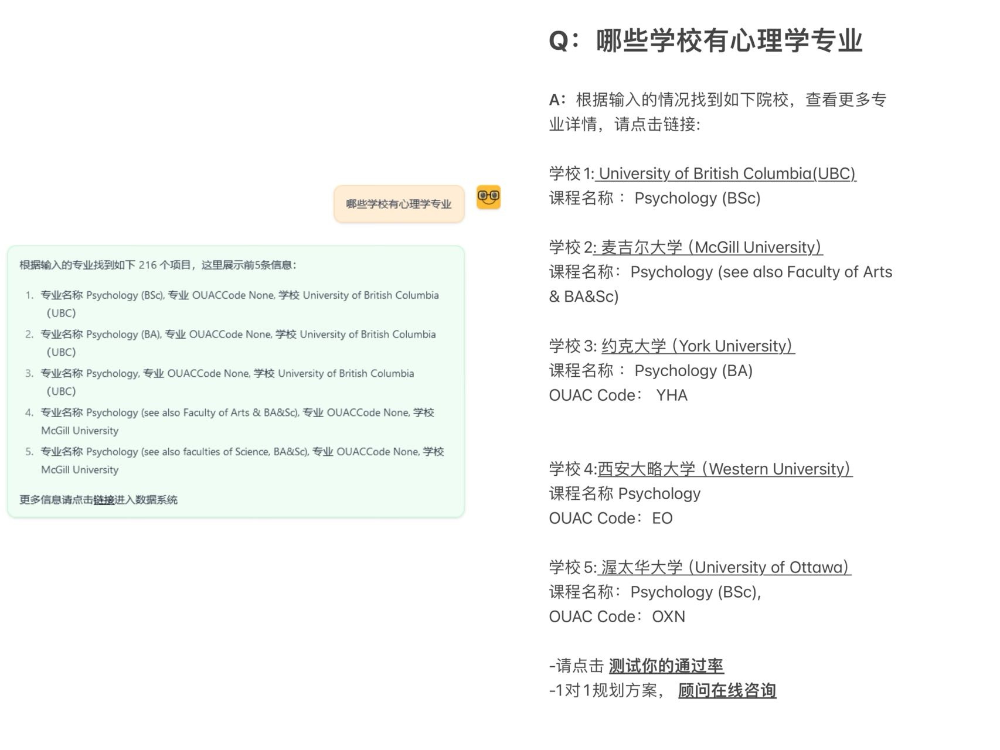
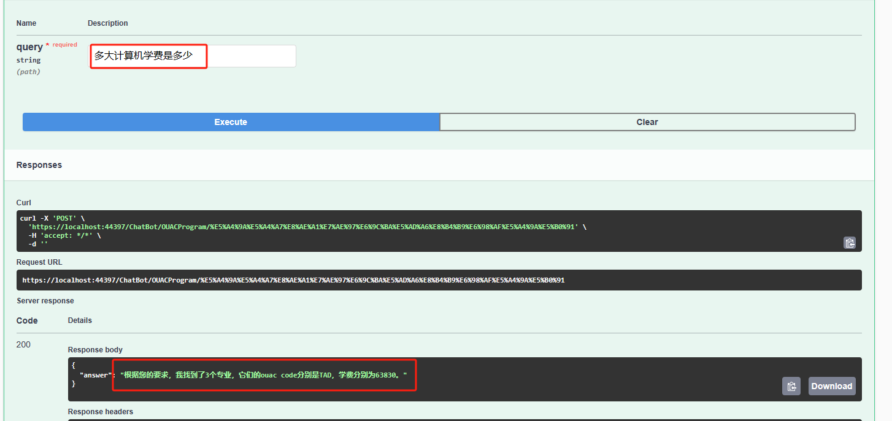
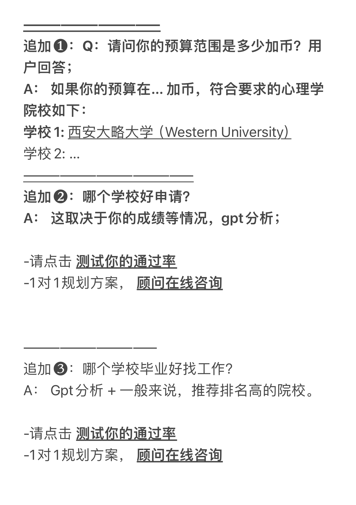

## 4 类问题

### 1. 跟大学录取要求相关的问题：

**a. 常用问题：**

【xx大学】的录取要求

**b. 示例：**



左侧是之前方案给出的答案，右侧是产品优化的结果

**c. 代码示例：**

```python
def search_university(self, full_n_univserity):
    try:
        self.cursor.execute(f"SELECT TOP 1 * FROM Schools WHERE Name LIKE '%{full_n_univserity}%'")
        columns = [column[0] for column in self.cursor.description]
        # print(columns)
        rows = self.cursor.fetchall()
        result = rows[0]
        dictionary = {columns[i]: result[i] for i in range(len(columns))}
        # print(dictionary)
        msg = f"""
        针对中国高中生的申请要求：

        最低录取 GPA：{dictionary["MinimumGPA"]}
        最低录取 IELTS ：{dictionary["MinimumIELTS"]}
            听力：{dictionary["MIListening"]}, 阅读：{dictionary["MIReading"]}, 口语：{dictionary["MISpeaking"]}，写作：{dictionary["MIWriting"]}
        最低录取 TOEFL ：{dictionary["MinimumTOEFL"]}
            听力：{dictionary["MTListening"]}, 阅读：{dictionary["MTReading"]}, 口语：{dictionary["MTSpeaking"]}，写作：{dictionary["MTWriting"]}
        申请材料：{dictionary["ApplicationMaterials"]}
        申请要求：{dictionary["ApplicationRequirements"]}
        申请开始时间：{dictionary["ApplicationsOpenDate"]}
        申请截止时间：{dictionary["ApplicationsCloseDate"]}
        第一轮发放 offer 日期：{dictionary["FirstRoundOffersDate"]}
        申请费用：{dictionary["ApplicationFee"]}
        平均学费：{dictionary["AnnualExpenses"]}
        """
        return len(result), msg
    except:
        return 0, None
```

### 2. 跟大学具体的专业录取要求相关的问题

**a. 常用问题：**

【xx大学xx专业/xx系】的录取要求，

**b. 示例：**







**c. 代码示例：**

```python
def search_university_major(self, full_n_univserity, major_in_cn, major_in_en, **kwargs):
    try:
        self.cursor.execute(f"SELECT t1.Id, t1.Name, t1.ChineseName, t1.GPA, t1.ReferenceLink, t2.MinimumIELTS, t2.MinimumTOEFL, t2.GaoKao FROM SchoolPrograms t1 JOIN Schools t2 ON t1.SchoolId = t2.Id WHERE t2.Name LIKE '%{full_n_univserity}%' AND (t1.Name LIKE '%{major_in_en}%' or t1.ChineseName LIKE '%{major_in_cn}%')")
        columns = [column[0] for column in self.cursor.description]
        print(columns)
        rows = self.cursor.fetchall()
        dictionaries = []
        number = len(rows)
        print(rows)
        for row in rows[:2]:
            dictionary = {columns[i]: row[i] for i in range(len(columns))}
            requirements = self.__search_requirement(dictionary["Id"])
            print(requirements)
            dictionary["requirements"] = requirements
            dictionaries.append(dictionary)
        print(dictionaries)
        
        msg = f"""
        将用户输入的信息整理成如下的格式，并返回给用户文本格式。
        展示如下所有的内容根据用户的输入

        用户的输入是 {dictionaries}

        n1 是 dictionaries[0]["requirements"] 的长度
        n2 是 dictionaries[1]["requirements"] 的长度
        
        将输入的内容整理成如下格式，

        输出信息，以文本格式输出，注意换行：
        `
        根据输入的信息，匹配到如下的信息：

        课程 1：{dictionaries[0]["ChineseName"]} - [{dictionaries[0]["Name"]}]({dictionaries[0]["ReferenceLink"]})

        课程 2：{dictionaries[1]["ChineseName"]} - [{dictionaries[1]["Name"]}]({dictionaries[1]["ReferenceLink"]})

        总结：
        - GPA： {dictionaries[0]["GPA"]}
        - 雅思：{dictionaries[0]["MinimumIELTS"]}
        - 托福：{dictionaries[0]["MinimumTOEFL"]}
        - 高考成绩：`if {dictionaries[0]["GaoKao"]} 为 False 返回用户结果：否，为 True 返回用户结果： 是`
        - 必要课程：`dictionaries[0]["requirements"][0]["Code"], ... ,dictionaries[0]["requirements"][n]["Code"]`
        """
        print(msg)
        return len(rows), msg
    except:
        return 0, None
```

### 3. 从专业角度询问学校的情况

**a. 常用问题：**

什么学校有【xx专业】

**b. 示例：**



**c. 代码示例：**

```python
def search_major(self, major_in_cn, major_in_en):
    try:
        self.cursor.execute(f"WITH RankedPrograms AS (SELECT t1.Id, t1.Name, t1.ReferenceLink, t1.OUACCode, t2.Name as University, ROW_NUMBER() OVER (PARTITION BY t2.Name ORDER BY t1.Id) as Rank FROM SchoolPrograms t1 JOIN Schools t2 ON t2.Id = t1.SchoolId WHERE t1.Name LIKE '%{major_in_en}%' OR t1.ChineseName LIKE '%{major_in_cn}%') SELECT TOP 5 * FROM RankedPrograms WHERE Rank = 1;")
        columns = [column[0] for column in self.cursor.description]
        rows = self.cursor.fetchall()
        number = len(rows)
        dictionaries = []
        uni_university = {}
        i = 0
        for row in rows:
            dictionary = {columns[i]: row[i] for i in range(len(columns))}
            if dictionary['University'] not in uni_university:
                dictionaries.append(dictionary)
                uni_university[dictionary['University']] = i
                if i < 5:
                    i += 1
                else:
                    break
        msg = f"""
        按照如下格式以文本格式输出：

        其中 n = 5
        dictionaries = {dictionaries}

        输出内容，注意换行：

        ```根据输入的信息找到如下院校，查看更多专业详情，请点击链接： 

        学校 1： [{dictionaries[0]['University']}]({dictionaries[0]['ReferenceLink']})
                    课程名称： {dictionaries[0]['Name']}
        学校 2： [{dictionaries[1]['University']}]({dictionaries[1]['ReferenceLink']})
                    课程名称： {dictionaries[1]['Name']}
        学校 3： [{dictionaries[2]['University']}]({dictionaries[2]['ReferenceLink']})
                    课程名称： {dictionaries[2]['Name']}
        学校 4： [{dictionaries[3]['University']}]({dictionaries[3]['ReferenceLink']})
                    课程名称： {dictionaries[3]['Name']}
        学校 5： [{dictionaries[4]['University']}]({dictionaries[4]['ReferenceLink']})
                    课程名称： {dictionaries[4]['Name']}
        ```
        
        
        """
        return len(rows), msg
    except:
        return 0, None
```

### 4.具体的学校和专业的细节

**a. 常用问题：**

【xx大学xx专业/xx系】的学费是多少

**b. 示例：**




### 5. 从产品角度希望增加的问题


